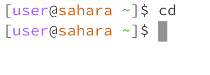
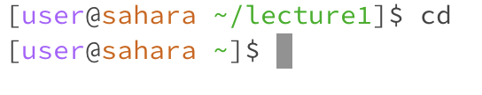
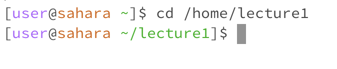
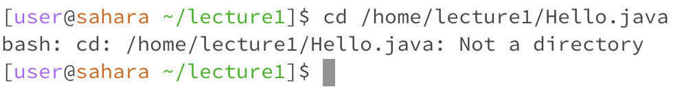
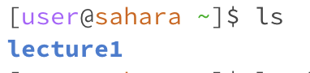
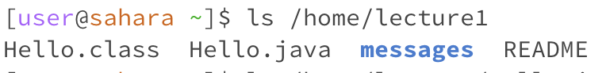
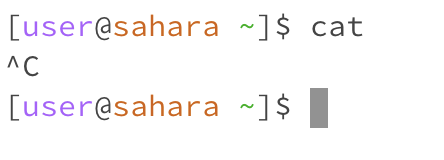
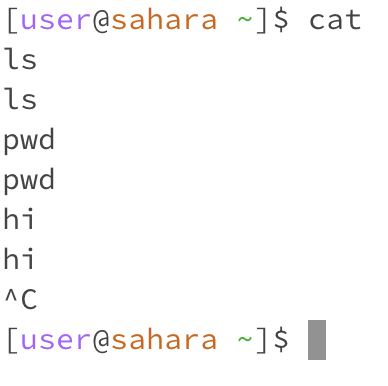
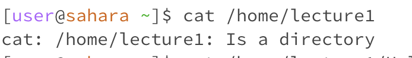
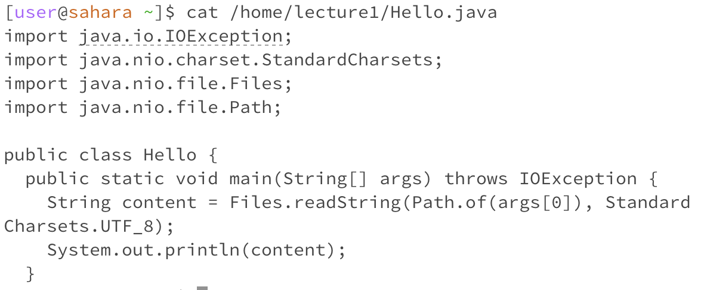

# CSE 15L Lab Report 1
## Amber Tse A16776236 10/9/2023

Unix Commands:
1. cd
   - Example of cd with *no arguments*:\
     
     
     Working Directory: /home (~ represents /home directory)\
     There was no change to the directory because no argument was entered. The directory stayed as /home.\
     The output was not an error.

     Although, a different result appears if running cd with no arguments on a directory that is not the home directory.\
      
     
     Working Directory: /home/lecture1\
     doing cd with no arguments when the directory is not the home directory, it changes the directory to the home directory. I ran cd with no arguments in /home/lecture1, and the directory changed to the home directory, /home.\
     The output was not an error 

     
   - Example of cd with path to a *directory*:\
     
     
     Working Directory: /home\
     The output was a new line of the terminal with the directory now being /home/lecture1, which was the argument entered after the cd command.\
     The output was not an error.

   - Example of cd with path to a *file*:\
     
     
     Working directory: /home/lecture1\
     The output repeated the file path name entered as an argument in the cd command, saying that the argument was not a directory. This was because to use the cd command, a path to a directory needs to be used as an argument. No change to the working directory was made.\
     The output was an error message saying the inputed argument was not a directory because a file path was used as an argument to try and change the working directory with the cd command.

     
2. ls
   - Example of ls with *no arguments*:\
     

     Working directory: /home\
     The output was "lecture 1" because the ls command lists the files and folders located in the working directory or given path. Since no path argument was given, ls listed the file in the working directory, which was /home.\
     The output was not an error.

   
   - Example of ls with path to a *directory*:\
      

     Working directory: /home\
     The output were the files and folders in /home/lecture1, since that was the path argument given to the ls command.\
     The output was not an error.

   
   - Example of ls with path to a *file*:\
      

     Working directory: /home\
     The output repeated the file path that was given as the argument because there are no files or folders located within /home/lecture1/Hello.java.\
     The output was not an error.
   
3. cat
   - Example of cat with *no arguments*:\
     

     

     Working directory: /home\
     There was no output with the command cat and no arguments because cat prints out the contents of the file(s) located in the given path, but there was no path given. Although, when I try typing something into the terminal after I run cat with no arguments and I press enter, the output returns whatever I typed(see second picture). I can keep on doing this until I press ctrl C to stop cat from running. 
     The output was not an error. 

     
   - Example of cat with path to a *directory*:\
     

     Working directory: /home\
     The output repeated the path that was given as an argument and stated that it was a directory. No content of any files were printed out because the given path was a directory and not a file.\
     The output indicates there was an error when running the command because cat is used to print out the contents of a file, but no contents were printed out since the path to a file was not given as the arguement.

   - Example of cat with path to a *file*:\
     

     Working directory: /home\
     The output was the contents of the Hello.java file, which was the class *Hello* and the main method. This was the output because the argument given with the cat command was a path to the Hello.java file.\
     The output was not an error. 

     

   
