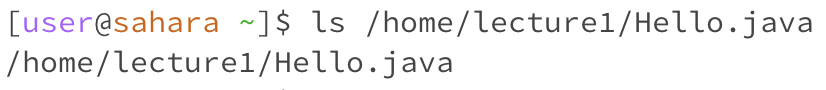

# CSE 15L Lab Report 1
## Amber Tse A16776236 10/9/2023

Unix Commands:
1. cd
   - Example of cd with *no arguments*:
  
     
     
     
     Working Directory: /home (~ represents /home directory)
     There was no change to the directory because no argument was entered. The directory stayed as /home. 
     The output was not an error.
     
   - Example of cd with path to a *directory*:

      
     
     Working Directory: /home
     The output was a new line of the terminal with the directory now being /home/lecture1, which was the argument entered after the cd command.
     The output was not an error. 
     
   - Example of cd with path to a *file*:
     
  
     
     
     Working directory: /home/lecture1
     The output repeated the file path name entered as an argument in the cd command, saying that the argument was not a directory. This was because to use the cd command, a path to a directory needs to be used as an argument. No change to the working directory was made. 
     The output was an error message saying the inputed argument was not a directory because a file path was used as an argument to try and change the working directory with the cd command. 

     
2. ls
   - Example of ls with *no arguments*:

   
     

     Working directory: /home
     The output was "lecture 1" because the ls command lists the files and folders located in the working directory or given path. Since no path argument was given, ls listed the file in the working directory, which was /home.
     The output was not an error. 
   
   - Example of ls with path to a *directory*:
  

      

     Working directory: /home
     The output were the files and folders in /home/lecture1, since that was the path argument given to the ls command.
     The output was not an error.
   
   - Example of ls with path to a *file*:
  

      

     Working directory: /home
     The output repeated the file path that was given as the argument because there are no files or folders located within /home/lecture1/Hello.java.
     The output was not an error. 
   
3. cat
   - Example of cat with *no arguments*:

   
     

     Working directory:
     
   - Example of cat with path to a *directory*:
  
     
     

     Working directory:
     

   - Example of cat with path to a *file*:
  
     
     

     Working directory: 

     

   
