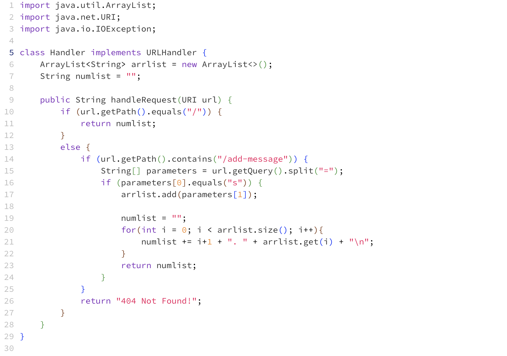
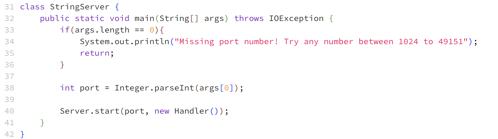
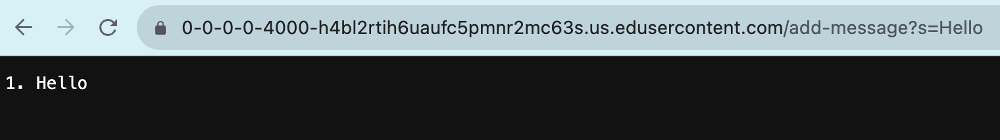
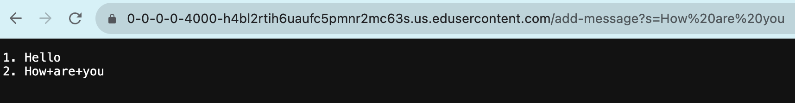

# CSE 15L Lab Report 2
## Amber Tse A16776236 10/22/2023

StringServer Code:

*******

The handleRequest method in my code gets called during this screenshot.\
The argument in the handleRequest method is called url and it is the url of the server.
The field arrlist, which is an arraylist to hold the entries from adding a message, starts
out as an empty arraylist before the add message request is made. The string numlist, 
which is the string format of all the entries in the arraylist, also starts out as an 
empty string. The array of strings called parameters is empty before the request is made. \
The value of arrlist is changed from this request to be [Hello]. numlist is also changed to be 
1. Hello

parameters gets updated to be {s, Hello}.

********

The handleRequest method in my code gets called during this screenshot.\
The argument in the handleRequest method is called url and it is the url of the server.
The field arrlist starts out as [Hello] before the add message request is made.
The string numlist, starts out as "1\. Hello". The array of strings called parameters 
is {s, Hello}. \
The value of arrlist is changed from this request to be [Hello, How+are+you]. numlist is also changed to be 
1. Hello 
2. How+are+you

parameters gets updated to be {s, How+are+you}.
