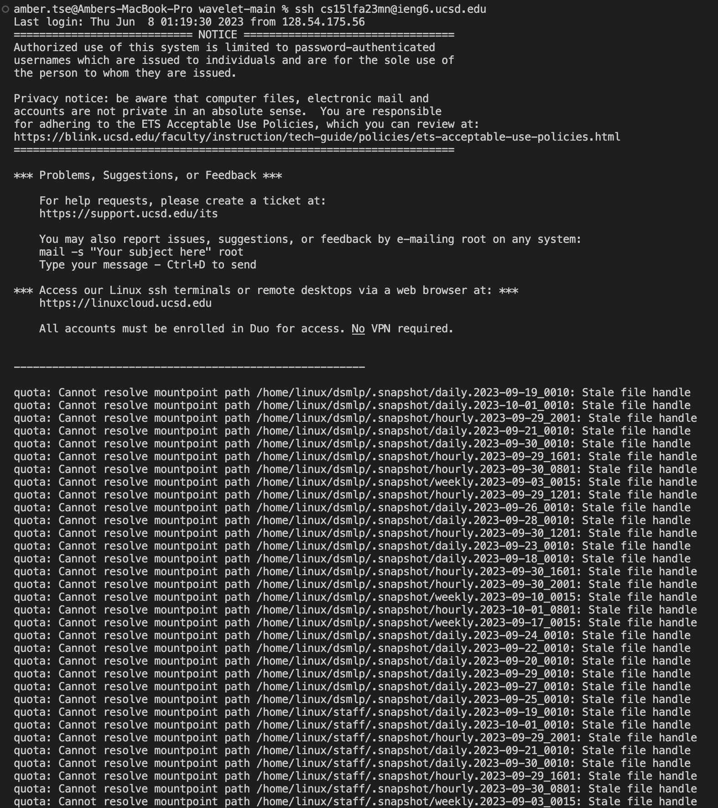
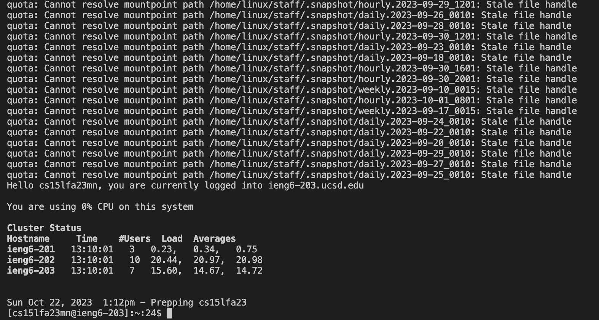

# CSE 15L Lab Report 2
## Amber Tse A16776236 10/22/2023

StringServer Code:


*******


The handleRequest method in my code gets called during this screenshot.\
The argument in the handleRequest method is `URI url` and it is the url of the server. For this scenario the `url` is `https://0-0-0-0-4000-h4bl2rtih6uaufc5pmnr2mc63s.us.edusercontent.com/add-message?s=Hello`.
The field `arrlist`, which is an arraylist to hold the entries from adding a message, starts out as an empty arraylist before the add message request is made. The string `numlist`, which is the string format of all the entries in the arraylist, also starts out as an empty string. The array of strings called `parameters` is empty before the request is made. \
The value of `arrlist` is changed from this request to be `[Hello]`. `numlist` is also changed to be 
`1. Hello`

`parameters` gets updated to be `{s, Hello}`.

********


The handleRequest method in my code gets called during this screenshot.\
The argument in the handleRequest method is `URI url` and it is the url of the server. For this scenario the `url` is `https://0-0-0-0-4000-h4bl2rtih6uaufc5pmnr2mc63s.us.edusercontent.com/add-message?s=How%20are%20you`.
The field `arrlist` starts out as `[Hello]` before the add message request is made.
The string `numlist`, starts out as `"1. Hello".` The array of strings called `parameters` 
is `{s, Hello}`. \
The value of arrlist is changed from this request to be `[Hello, How+are+you]`. `numlist` is also changed to be 
```
1. Hello 
2. How+are+you
```

`parameters` gets updated to be `{s, How+are+you}`.

********


Path to my private key on my local computer:


Path to my public key from my ieng6 account:


*Note: my public key is saved into the file called `authorized_keys`, which is the file of the path shown above. 


Logging into ieng6 without password:




******

I didn't know before that multiple people are able to log into a remote computer at once. During lab, all the CSE15L students were using their ieng6 account to log into the 201, 202, or 203, computers, and multiple people were able to be connected to a computer at once. I also learned the components of a URL and how to write code that changes the server's output as you add a query in the URL. 


