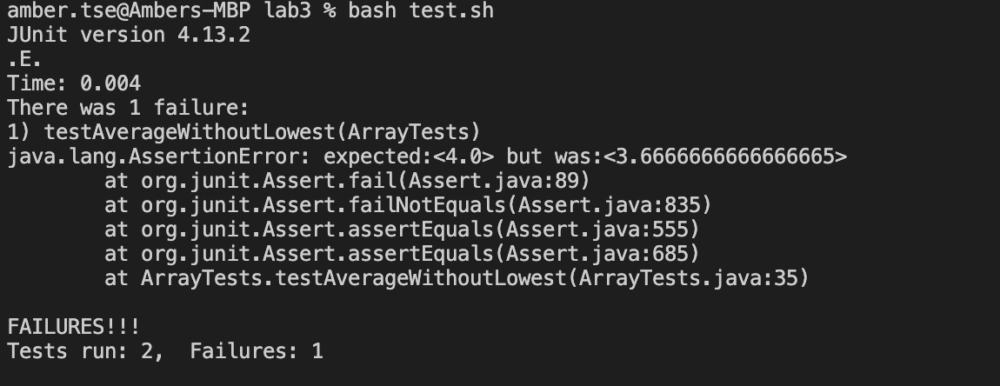

# CSE 15L Lab Report 3
## Amber Tse A16776236 11/5/2023

Part 1:\
The bug I will be looking at is the one associated with the averageWithoutLowest mehtod\


Failure-inducing input as a JUnit test:\

    @Test
      public void testAverageWithoutLowest(){
        double[] arr1 = {1, 1, 5, 6};
        assertEquals(4.0, ArrayExamples.averageWithoutLowest(arr1),
           0.01);
      }

Input that doesn't induce a failure as a JUnit test:\

    @Test
      public void testEmptyAverageWithoutLowest(){
        double[] arr1 = {};
        assertEquals(0, ArrayExamples.averageWithoutLowest(arr1),
           0.01);
      }

Symptom:\



Bug before any change:\

``` javascript
    static double averageWithoutLowest(double[] arr) {
        if(arr.length < 2) { return 0.0; }
        double lowest = arr[0];
        for(double num: arr) {
          if(num < lowest) { lowest = num; }
        }
        double sum = 0;
        for(double num: arr) {
          if(num != lowest) { sum += num; }
        }
        return sum / (arr.length - 1);
      }
```

I included the entire averageWithoutLowest method here. The  code where the bug is located is on line 8, where it says if(num != lowest) { sum += num; }


Bug after change:\

    static double averageWithoutLowest(double[] arr) {
        if(arr.length < 2) { return 0.0; }
        double lowest = arr[0];
        int index = 0;
        for(double num: arr) {
          if(num < lowest) { 
            lowest = num;
            index +=1;
          }
        }
        double sum = 0;
        arr[index] = 0;
        for(double num: arr) {
          sum += num; 
        }
        return sum / (arr.length - 1);
      }

  To fix the bug, I altered the code to find the index of the lowest double in the array given in the argument. The double at the index found is then changed to 0. This allows the average to be caluclated by divinding the sum of the doubles in the array by the length of the double array minis 1, to account for the lowest dowble being dropped. By changing the lowest double value to a 0, it does not affect the value of the sum, and it allows for there to be duplicates of the lowest doubles in the array without leaving out more than 1 lowest double when calculating the average. 

