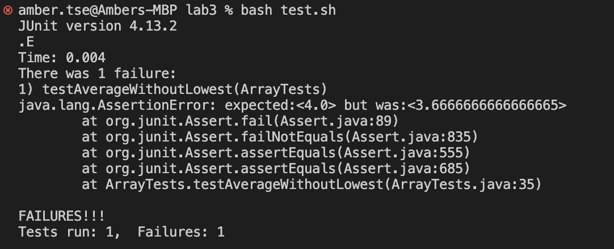
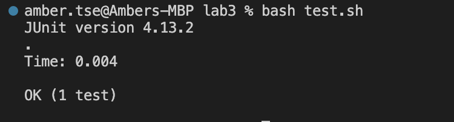

# CSE 15L Lab Report 3
## Amber Tse A16776236 11/5/2023

Part 1:

The bug I will be looking at is the one associated with the averageWithoutLowest method.


Failure-inducing input as a JUnit test:

``` javascript
    @Test
      public void testAverageWithoutLowest(){
        double[] arr1 = {1, 1, 5, 6};
        assertEquals(4.0, ArrayExamples.averageWithoutLowest(arr1),
           0.01);
      }
```
Input that doesn't induce a failure as a JUnit test:
``` javascript
    @Test
      public void testEmptyAverageWithoutLowest(){
        double[] arr1 = {};
        assertEquals(0, ArrayExamples.averageWithoutLowest(arr1),
           0.01);
      }
```
Symptoms (Running tests with failure and non-failure inducing output):





Bug before any change:

``` javascript
    static double averageWithoutLowest(double[] arr) {
        if(arr.length < 2) { return 0.0; }
        double lowest = arr[0];
        for(double num: arr) {
          if(num < lowest) { lowest = num; }
        }
        double sum = 0;
        for(double num: arr) {
          if(num != lowest) { sum += num; }
        }
        return sum / (arr.length - 1);
      }
```

I included the entire averageWithoutLowest method here. The code where the bug is located is on line 8:
``` javascript
if(num != lowest) { sum += num; }
```

After change:

``` javascript
    static double averageWithoutLowest(double[] arr) {
        if(arr.length < 2) { return 0.0; }
        double lowest = arr[0];
        int index = 0;
        for(double num: arr) {
          if(num < lowest) { 
            lowest = num;
            index +=1;
          }
        }
        double sum = 0;
        arr[index] = 0;
        for(double num: arr) {
          sum += num; 
        }
        return sum / (arr.length - 1);
      }
```
  To fix the bug, I altered the code to find the index of the lowest double in the array given in the argument. The double at the index found is then changed to 0. This allows the average to be caluclated by divinding the sum of the doubles in the array by the length of the double array minus 1, to account for the lowest dowble being dropped. By changing the lowest double value to a 0, it does not affect the value of the sum, and it allows for there to be duplicates of the lowest doubles in the array without leaving out more than 1 lowest double when calculating the average. 

Part 2:

grep command-line options:

-c:

```
$ grep -c ".txt" grep-results.txt
    1391
```

The -c command-line option returns the number of lines in the indicated file that match the inputed pattern, which is useful if you're looking for a command that will only show you the number of matching lines and not a bunch of other data. Here, `grep -c` is looking to see how many lines in `grep-results.txt` contain `.txt`.

```
$ grep -c "mouse" */*/1471-213X-1-1.txt
    12
```

In this example, `grep -c` is looking to see how many lines in `1471-213X-1-1.txt` contain `mouse`. If you are just wondering how many lines contain your inputed pattern in the inputed file, this command is helpful. 

-w:
```
$ grep -w "final" grep-results.txt
    technical//government/Env_Prot_Agen/final.txt
```

The -w command-line option matches with whole words. This is useful if your pattern is a string that is commonly used in words, but you are looking for just the individual word that the string represents. Here it is looking at the `grep-results.txt` file for lines containing `final`, and returns the matching line. 

```
$ grep -w "law" grep-results.txt
    technical//government/Media/Eviction law.txt
```

This -w command-line option matches with `law` in the `grep-results.txt` file, and only returns lines that match with whole words, and not partial matches. There are lines in `grep-results.txt` that contain the word `lawyer`, and as you'll see, those don't qualify as a match with this command. 

-o:
```
$ grep -o "mouse" */*/1471-213X-1-1.txt

    mouse
    mouse
    mouse
    mouse
    mouse
    mouse
    mouse
    mouse
    mouse
    mouse
    mouse
    mouse
```

The -o command-line option prints out only matching parts of a matching line. Here it is looking at the file `1471-213X-1-1.txt` for the word `mouse`, and returns all the matching parts of the lines. This is a good way to double check that the grep command is matching what you intend it to.

```
$ grep -o "plane" */*/1471-213X-2-7.txt

    plane
    plane
    plane
```

This command looked at the `1471-213X-2-7.txt` file for the word `plane`, and printed out the matching part of the lines that contained the word `plane`. Seeing `plane` printed out every time it matches is a good way to check that the command is matching to what you intend it to. 


-n:

```
$ grep -n "mouse" */*/1471-213X-1-1.txt 
    27:        Gad2 knockout mouse [ 15, 16]. In
    69:        The mouse 
    75:        mouse embryos by whole mount 
    84:        secondary body axis formation in the mouse embryo [ 28].
    166:        outside of the central nervous system during mouse
    210:        E10.5-E12.5 mouse embryos [ 27]. Our analysis showed that 
    218:        mouse embryo.
    230:        mouse embryos 
    243:        the mouse embryo, suggesting a potential role for GABA
    257:        additional non-CNS tissues in the mouse embryo. It is
    272:        The mouse gene encoding the 67 kDa isoform of glutamate
    277:        and ectoderm of the limb buds in mouse embryos from
```
The -n command-line option prints out the matching lines and their line numbers. This makes it helpful to find where in the file the matching line is located, and what the line should look like. Here it looked at the file `1471-213X-1-1.txt` for the word `mouse` and printed out the matching lines and line numbers. 

```
$grep -n "plane" */*/1471-213X-2-7.txt

    9:        structures are aligned in the plane of the epithelium. The
    28:        epidermis. Bristles are polarized within the plane of the
    438:          that surrounds the growing shaft remains in the plane of
```

This command looked at the file `1471-213X-2-7.txt` and printed out the matching lines and their line numbers for the word `plane`. This is useful when you want to find a particular part of the file containg the inputed word, and the line number makes it easy to go back into that file and fine the line you're looking for.  


Sources:

https://www.geeksforgeeks.org/grep-command-in-unixlinux/
