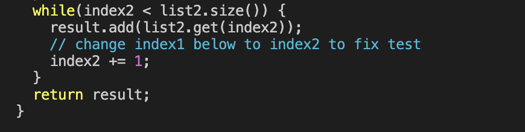

# CSE 15L Lab Report 3
## Amber Tse A16776236 11/5/2023

Step 4: 

Keys pressed: `ssh cs15lfa23mn@ieng6.ucsd.edu <enter>`. This logged me into my ssh ien6 account

Step 5: 

Keys pressed: `git clone git@github.com:ambermtse/lab7.git <enter>`. This cloned the fork of my repository using my `SSH` URL. 

Step 6:

Keys pressed: `cd lab7 <enter>`, `bash test.sh <enter>`. This changed my directory to `lab 7` and ran the `test.sh ` file, which compiles and runs the tests in the `ListExamplesTests.java` file.  

Step 7:

Keys pressed: `vim ListExamples.java <enter>`, `x` `i` `2`(cursor was already over error) `<esc>` `<shift>;wq<shift>1 <enter.` (types out `:wq!`) Enters vim and edits the `ListExamples.java` file

Step 8:

Keys pressed:`<up><up><enter>`. `bash test.sh` command was 2 up in the search history so I used the up arrow to access it. 

Step 9:

Keys pressed: `git add ListExamples.java <enter>`, `git clone`,(entered vim to enter commit message) `i` `index2 update` `<esc> ` `<shift>;wq<shift>1 <enter.`(types out `:wq!`), `git push`. Adds `ListExamples.java` to staging area, commits change, and pushes it out to the repositiory. 
